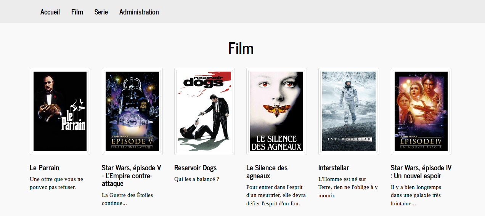

# Filmotheque
Application web de bibliotheque privé de film et series

## Présentation
Cette application Web est destinée à créer et à présenter une bibliotheque de film et de série

### Quelques copies d'écrans

## Fonctionnalités principales
* Scane les repertoires de film et de serie paramétré et en extrait les informations necessaires à la mise à jour de la bibliothèque.
* Complète les fiches films et séries crées avec les données disponibles sur la base de données "The Movie Database".

---
#### /!\ En cours de developpement
* Permet la consultation des films et serie via des outils de recherche intégrés
    * Recheche par genre, nationalité, realisateur, acteur...
    * trier

-------

## Technologie
 
* Java
     * Spring 4
     * Hibernate 4
     * Maven
     
* Base de données
      * Postgresql 9
      
* Versionnage 
      * git
      
## Installation
1. Creer la base de données en jouant le script [script_creation.sql](script_creation.sql)
2. Déployer le WAR sur un serveur de votre choix ( tester sur Tomcat 7)
3. Modifier le fichier application.properties dispo dans /webapps/Filmotheque/WEB-INF/classes
avec vos paramétrages ( user et mot de passe BDD, repertoire des films et series à scanner) 

      