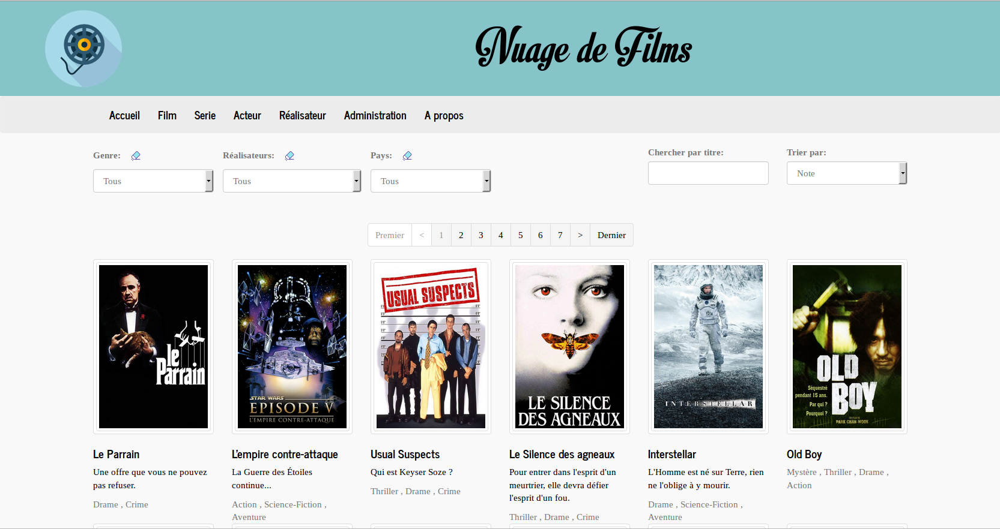
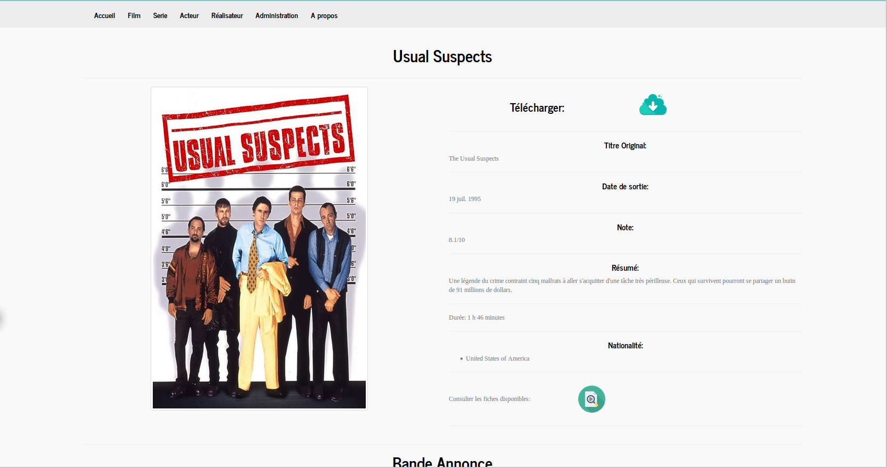
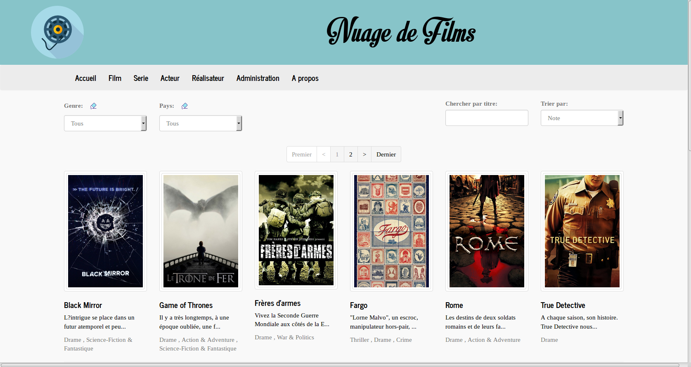
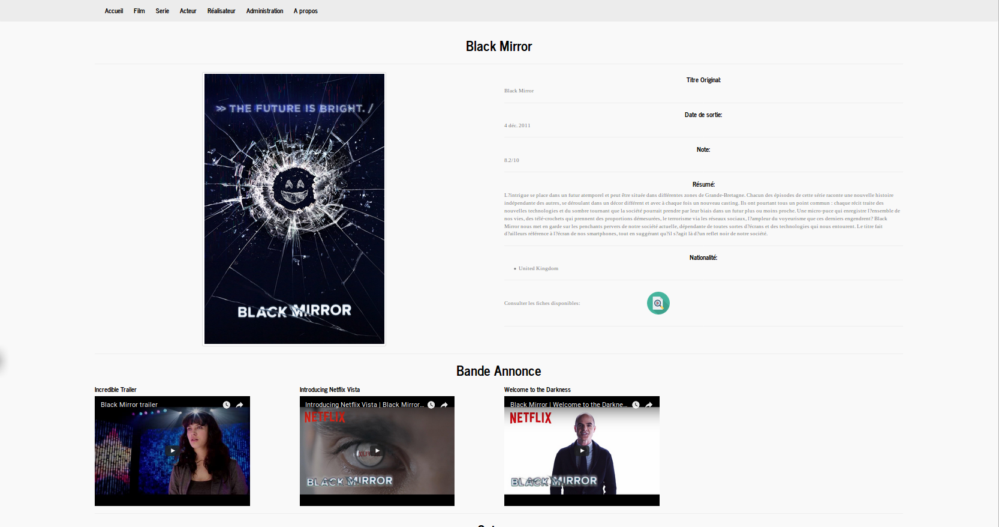
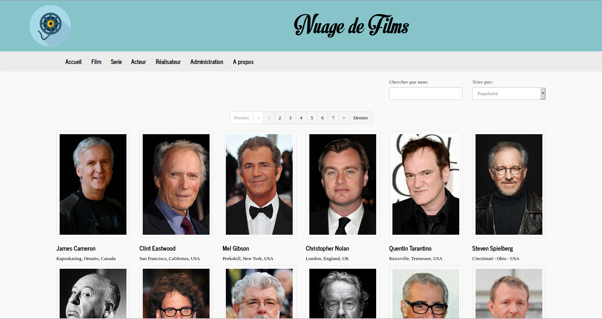

# Filmotheque
Application web de bibliotheque privé de film et series

## Présentation
Cette application Web est destinée à créer et à présenter une bibliotheque de film et de série

### Quelques copies d'écrans
#### Listes des films

---
#### Details films

---
#### Liste des Series

---
#### Details Serie

---
#### Acteur

---
#### Realisateur

---

## Fonctionnalités principales
* Scane les repertoires de film et de serie paramétré et en extrait les informations necessaires à la mise à jour de la bibliothèque.
* Complète les fiches films et séries crées avec les données mise à disposition par l'API "The Movie Database".
* Permet la consultation des films et serie via des outils de recherche intégrés
    * Recheche par genre, nationalité, realisateur, acteur...
    * Recherche textuelle sur les noms de films, serie, acteur, réalisateur...
    * trier
* Telechargement des films et series

-------

## Technologie
 
* Java
     * Spring 4
     * Hibernate 4 (Criteria)
     * Maven
     
* Base de données
     * Postgresql 9
      
* Versionnage 
     * git
      
## Installation
* Creer la base de données en jouant le script [script_creation.sql](script_creation.sql)
* Déployer le WAR sur un serveur de votre choix ( tester sur Tomcat 7)
* Modifier le fichier application.properties dispo dans /webapps/Filmotheque/WEB-INF/classes avec vos paramétrages
    * user et mot de passe BDD
    * API_KEY de the movie database
        * Gratuite, disponible dans les parametres de votre compte apres enregistrement gratuit sur https://www.themoviedb.org 
    * repertoire des films et series à scanner 

      